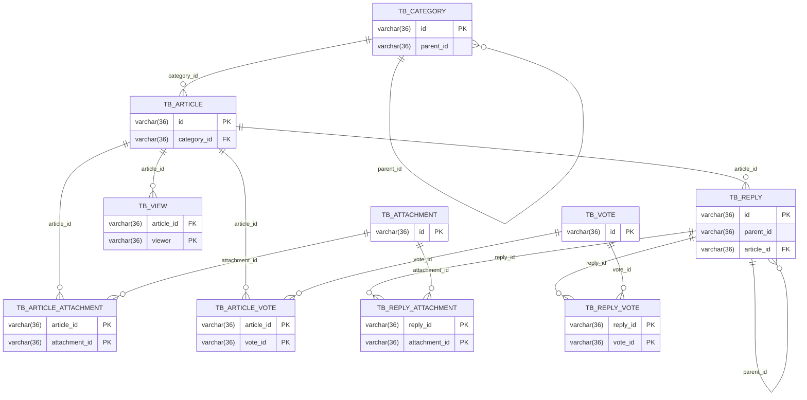

# 게시판 서비스 ERD 및 논리적 연관 관계

## 카테고리(TB_CATEGORY)
카테고리는 부모 카테고리(parent_id)와 자식 카테고리 관계를 가질 수 있습니다. 이것은 하위 카테고리가 하나인 상위 카테고리를 가리킬 수 있음을 의미합니다. 또한, 각 카테고리는 여러 개의 게시글(TB_ARTICLE)을 포함할 수 있습니다.

## 게시글(TB_ARTICLE)
게시글은 특정 카테고리(TB_CATEGORY, category_id 외래키 참조)에 속하게 됩니다. 게시글은 여러 개의 답글(TB_REPLY), 첨부파일(TB_ARTICLE_ATTACHMENT), 투표(TB_ARTICLE_VOTE), 그리고 조회(TB_VIEW)를 가질 수 있습니다.

## 답글(TB_REPLY)
답글은 부모 답글(parent_id)와 자식 답글 관계를 가질 수 있으며, 이는 하위 답글이 상위 답글을 참조할 수 있음을 의미합니다. 답글은 특정 게시글(TB_ARTICLE, article_id 외래키 참조)에 붙게 됩니다. 또한, 답글은 여러 첨부파일(TB_REPLY_ATTACHMENT)과 투표(TB_REPLY_VOTE)를 가질 수 있습니다.

## 첨부파일(TB_ATTACHMENT)
첨부파일은 게시글의 첨부(TB_ARTICLE_ATTACHMENT)또는 답글의 첨부(TB_REPLY_ATTACHMENT)로 사용될 수 있습니다.

## 투표(TB_VOTE)
투표는 게시글에 대한 투표(TB_ARTICLE_VOTE) 또는 답글에 대한 투표(TB_REPLY_VOTE)로 기록될 수 있습니다. 각 투표는 특정 게시글이나 답글을 참조하며, 이에 따라 사용자에 의한 특정 게시글 또는 답글에 대한 투표 결과를 추적할 수 있습니다.

## 조회(TB_VIEW)
조회는 특정 게시글(TB_ARTICLE, article_id 외래키 참조)에 대한 조회를 나타냅니다. 이를 통해 해당 게시글이 얼마나 많이 조회되었는지에 대한 정보를 유지할 수 있습니다.
